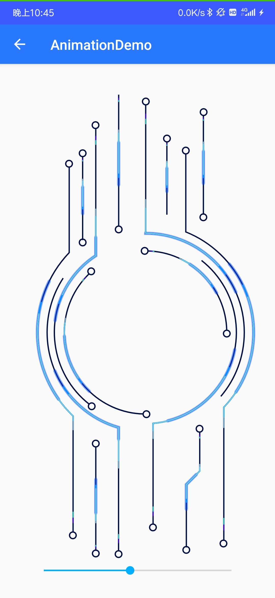

# Chapter 3

这次的作业主要实现一些动画以及了解使用Fragment。

# APK

apk为根目录下的Demo.apk

# 程序截图

主界面中选择不同的按钮可跳转到不同的页面。

在Lottie页面中可以通过拖动SeekBar调节动画的进度。

在属性动画页面中，可以通过点击按钮使图片播放Alpha，Scale和Alpha与Scale的混合动画。点击按钮后动画会重复播放一次。

在Fragment页面中有两个Fragment，每个Fragment中嵌套了一个RecyclerView，通过TabLayout可以跳转到不同的Fragment。

